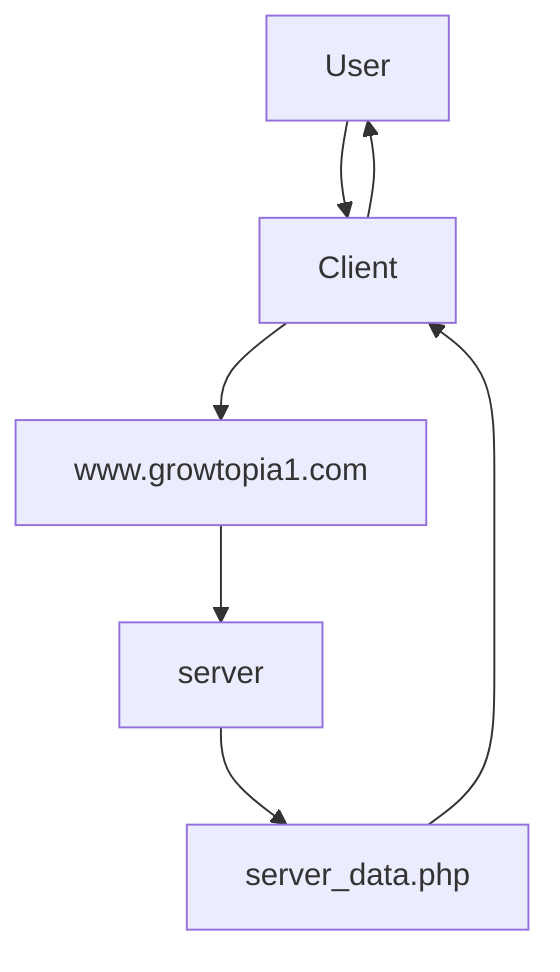
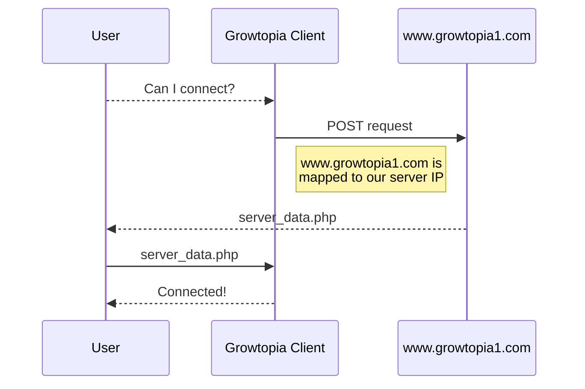

# User connection to server
1. User initiates connection through growtopia client.
	- User creates POST request to `www.growtopia1.com`.
	- User gets redirected to assigned server `IP` address, set through the `hosts` file.
2. Server returns `server_data.php` file.
3. File gets sent to growtopia game client.
4. User is connected to server.

# What server handles

Networking

Everything below but made to update to all connected peers.

Database

- Add data.
- Remove data.
- Update data.

Moving

- Jump
- Left
- Right
- Gravity
- Double Jump
- Slow Fall (/)
- Long Jump (/)
- No-Gravity. (/)

Worlds

- World generation.
- Locking, Ownership, Admins. (/)
- Weather effect. (/)

Building

- Static blocks.
- Doors. (/)
- Locks. (/)
- Signs. (/)
- Spikes. (/)
- Lava.
- Water. (/)
- Glue. (/)
- Paint. (/)
- ... (/)

Breaking

- Static blocks.
- Dropping seeds, gems, blocks.
- Locks.
- Water. (/)
- Fossil. (/)

Planting

- Planting.
- Splicing.

Harvesting

- Plant drops. (Gems, Seeds, Blocks, Etc...)

